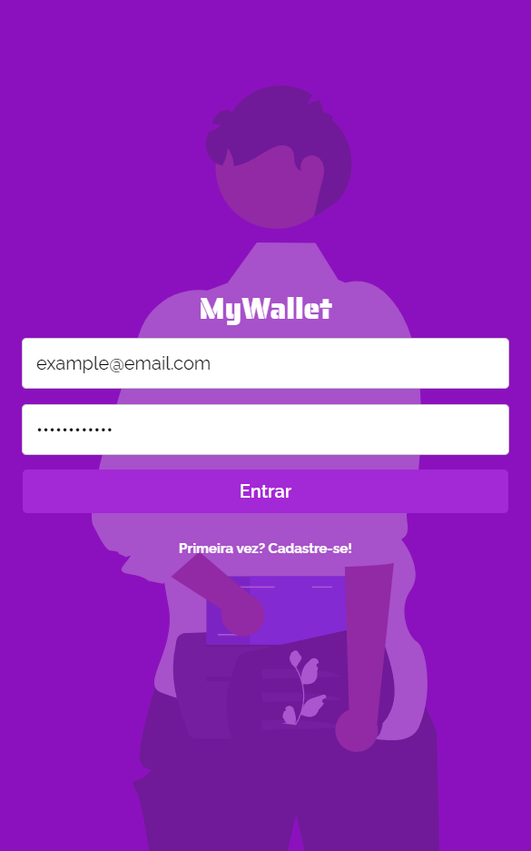
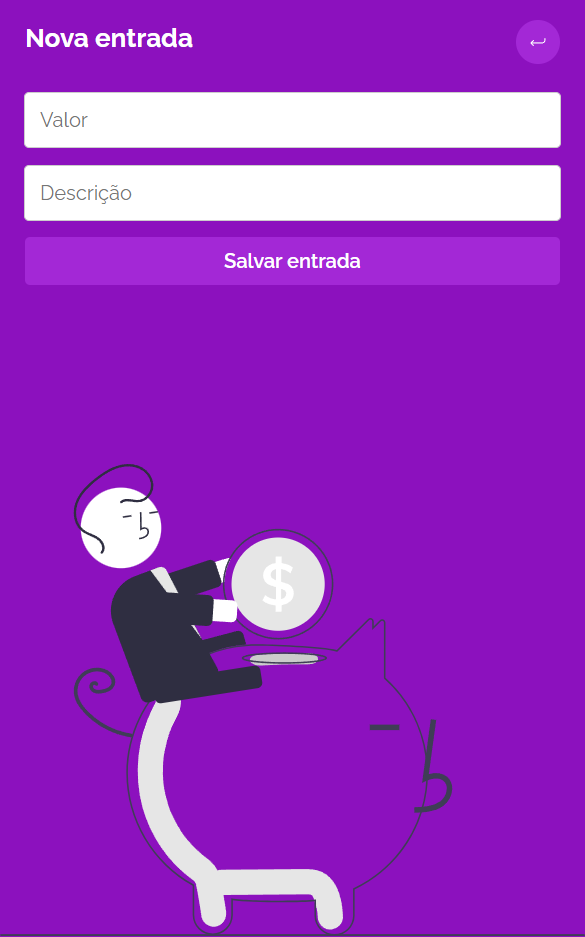
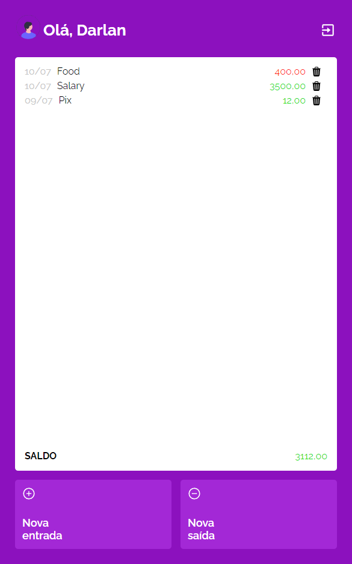

# My Wallet

Welcome to My Wallet, a full-stack application that helps you manage your finances. This repository contains the source code for the frontend of My Wallet. The fronted is built with React.js ,Vite, Styled components, React-Toastify and others. 
The application is deployed using Vercel as the frontend server.

## Features

- User registration and authentication
- Login persistence
- Add and manage income and expenses
- Edit and or delete transactions
- Transaction history

## You can test the app at https://my-wallet-mu-ten.vercel.app/

